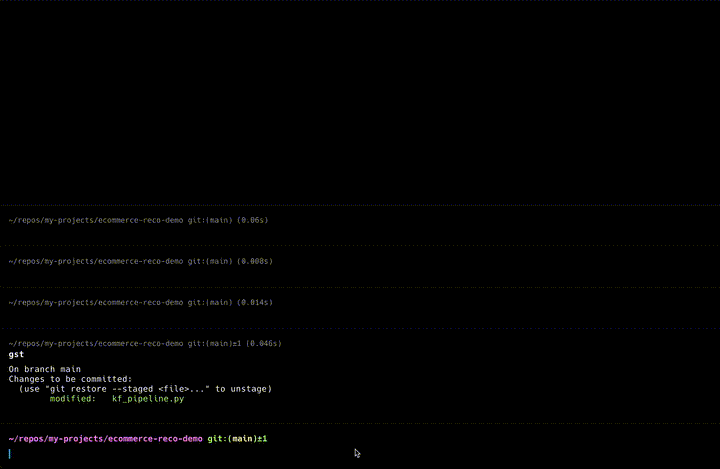

# ai-commit

**Automatically generate commit messages with AI** whenever you run `git commit`.  
This repo provides a cross-platform Go binary and a Git `prepare-commit-msg` hook that integrates an AI prompt.

---

## Demo

Here's a quick GIF showing how `ai-commit` works in action:

  

---

## Quick Start

1. **Initialize a Git repository** (or use an existing one).  
2. **Install** AI Commit in 1 click:

   ```bash
   curl -sL https://raw.githubusercontent.com/joeeeeey/ai-commit/main/install.sh | bash


## Installation

### Prerequisites

1. **Go**: You need Go installed if you want to build the binary from source. Otherwise, you can download a pre‑compiled binary from [Releases](https://github.com/joeeeeey/ai-commit/releases) (if you provide them).
2. **Git**: Obviously, you need Git installed.
3. **API Key**: This tool calls an AI service. Make sure to set `AI_COMMIT_TOKEN` in your environment.

### 1-Click Installer (Example)

You can provide a convenient script (e.g. `install.sh`) that people can curl & run. For example:

```bash
# One-liner
curl -s https://raw.githubusercontent.com/joeeeeey/ai-commit/main/install.sh | bash
```

## Test by curl
```bash

curl -X POST 'https://api.dify.ai/v1/workflows/run' \
--header "Authorization: Bearer ${AI_COMMIT_TOKEN}" \
--header 'Content-Type: application/json' \
--data-raw '{
    "inputs": {
      "repo_name": "k8s",
      "diff_text": "-    local prodReplicas = if context.Region == 'us-west-1' then 9 else 1, \n+    local prodReplicas = if context.Region == 'us-west-1' then 1 else 1,"
  },
    "response_mode": "blocking",
    "user": "abc-123"
}'
```